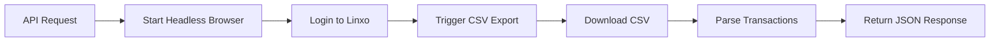
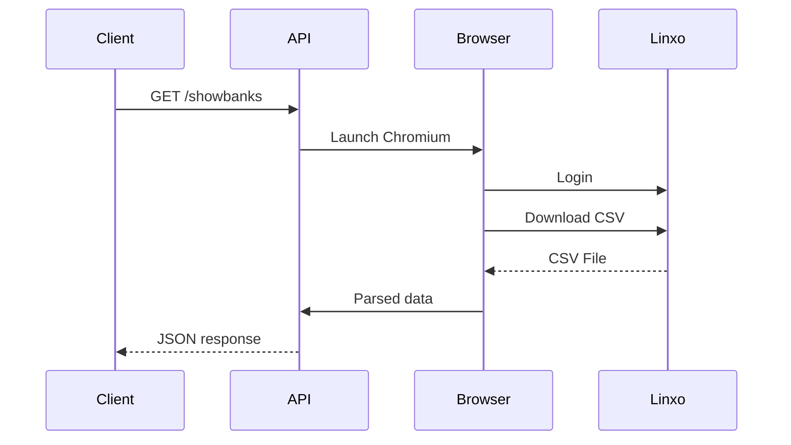

# 🚀 **Linxo Transaction Reader**

> **Turn Linxo into a JSON API - simple, automated, script-friendly**

**Linxo Transaction Reader** is a lightweight Go service that automates transaction extraction from [Linxo](https://www.linxo.com/) using a headless browser and exposes the result as a clean **HTTP JSON API**.

Designed for automation, observability, and personal finance tooling.

---

## ✨ **Key Concept - Web UI as an API**

Linxo does not provide a public API - this service turns the **web interface into one**.

> If a human can export it → this service can automate it.

Instead of reverse engineering APIs, it reproduces the real user workflow through a browser.

### ⚙️ **End-to-End Flow**



### 🔁 **Execution Pipeline**

1. 🌐 Launch Chromium via Rod
2. 🔐 Authenticate to Linxo
3. 📥 Export transactions as CSV
4. 🔄 Parse into structured Go models
5. 📡 Return JSON via HTTP API

### ✅ **Why this approach**

* 🔌 **API without API** - no dependency on unofficial endpoints
* 🤖 **Fully automated** - no manual export
* 📦 **Lightweight** - single Go binary / Docker container
* 🧩 **Composable** - easy to plug into pipelines
* 🔍 **Transparent** - behavior matches real user actions

---

## 🔍 **Features Overview**

### 🌐 **HTTP API**

| Feature         | Description                           |
| --------------- | ------------------------------------- |
| 📡 `/showbanks` | Fetch and return transactions as JSON |
| 🔐 API key auth | Protect access via header/token       |
| 📄 JSON output  | Structured transaction format         |

### 🤖 **Browser Automation Engine**

| Component           | Description                 |
| ------------------- | --------------------------- |
| Chromium (headless) | Executes the Linxo workflow |
| Rod                 | Controls browser lifecycle  |
| Auth flow           | Handles login session       |
| Export flow         | Automates CSV download      |

### 📦 **Project Architecture**

```text
cmd/linxo-reader/      Entry point
internal/
  api/                 HTTP server, routes, middleware
  browser/             Chromium lifecycle via Rod
  config/              Environment & flag configuration
  linxo/               Linxo domain logic (auth, CSV, orchestration)
models/
  transaction.go       Domain types (Transaction, CSVRecord)
```

---

## ⚙️ **Configuration**

All configuration is driven by **environment variables** and **CLI flags**.

### 🔑 **Required**

| Variable         | Description                   |
| ---------------- | ----------------------------- |
| `API_KEY`        | API key for securing requests |
| `LINXO_EMAIL`    | Linxo account email           |
| `LINXO_PASSWORD` | Linxo account password        |

### ⚙️ **Optional**

| Variable / Flag   | Default | Description                  |
| ----------------- | ------- | ---------------------------- |
| `CHROME_BIN`      | auto    | Path to Chromium binary      |
| `BROWSER_TIMEOUT` | `3m`    | Max browser session duration |
| `-debug`          | false   | Run browser in visible mode  |
| `-port`           | 8080    | HTTP listening port          |

---

## 📥 **Installation & Usage**

### 🧪 **Run from source**

```bash
export API_KEY="your-secret-key"
export LINXO_EMAIL="you@example.com"
export LINXO_PASSWORD="your-password"

go run ./cmd/linxo-reader
```

### 🐳 **Run with Docker**

```bash
docker build -t linxo-reader .

docker run -p 8080:8080 \
  -e API_KEY="your-secret-key" \
  -e LINXO_EMAIL="you@example.com" \
  -e LINXO_PASSWORD="your-password" \
  linxo-reader
```

---

## 📡 **API Usage**

### 🔍 Fetch transactions

```bash
curl -H "X-Api-Key: your-secret-key" \
  http://localhost:8080/showbanks
```

### 📄 Example response

```json
[
  {
    "from": "CARTE MONOPRIX",
    "category": "Courses",
    "amount": "-42.50",
    "date": "28/03/2026",
    "note": ""
  }
]
```

---

## 🔐 **Authentication**

Every request must include a valid API key:

| Method | Example                       |
| ------ | ----------------------------- |
| Header | `X-Api-Key: <key>`            |
| Bearer | `Authorization: Bearer <key>` |

---

## 🛠️ **Runtime Behavior**

### 🌐 Browser lifecycle



### 🧪 Debug mode

```bash
go run ./cmd/linxo-reader -debug
```

### ⏱️ Timeout tuning

```bash
export BROWSER_TIMEOUT=5m
```

### 🌍 Custom browser path

```bash
export CHROME_BIN=/usr/bin/chromium
```

---

## 🎯 **Use Cases**

* 📊 Personal finance dashboards
* 🔄 Automated reporting pipelines
* 📦 Data ingestion into other systems
* 🧾 JSON export instead of CSV
* 🏠 Self-hosted financial tooling

---

## ⚠️ **Limitations**

* Depends on Linxo web UI stability
* UI changes may break automation
* Requires a working browser environment
* Not an official Linxo API

---

## 🤝 **Contributing**

Contributions are welcome:

* 🐛 Bug reports
* 💡 Feature suggestions
* 🔧 Pull requests

```bash
git checkout -b feature/your-feature
```

---

## 📄 **License**

This project is licensed under the [MIT License](https://opensource.org/licenses/MIT).
